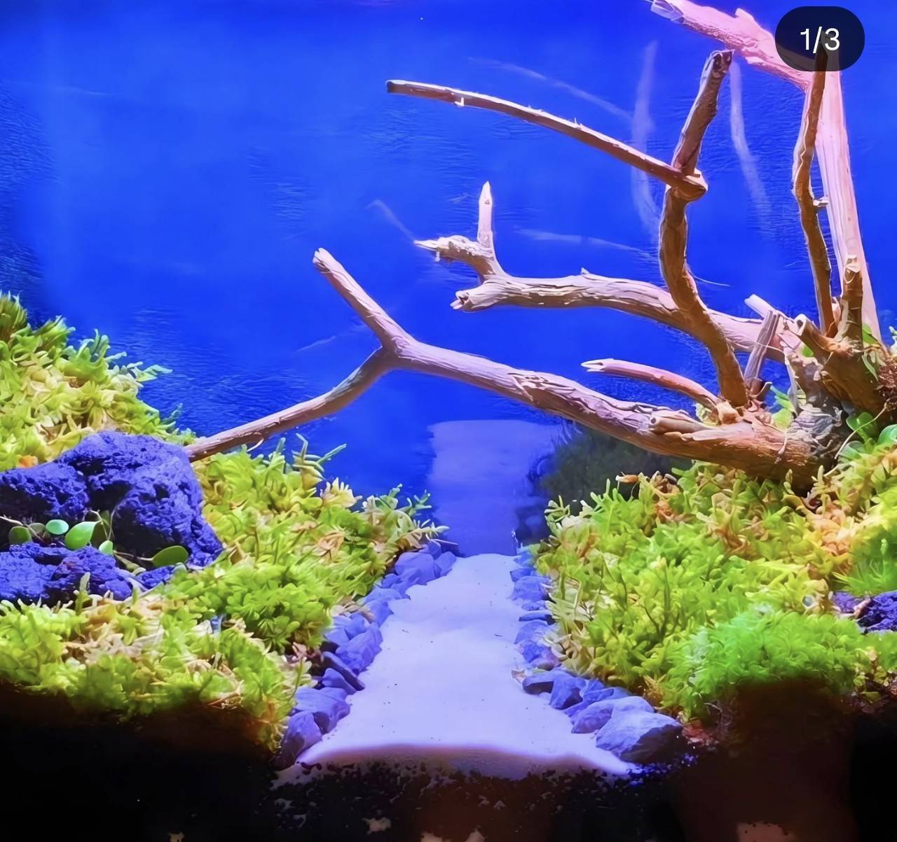
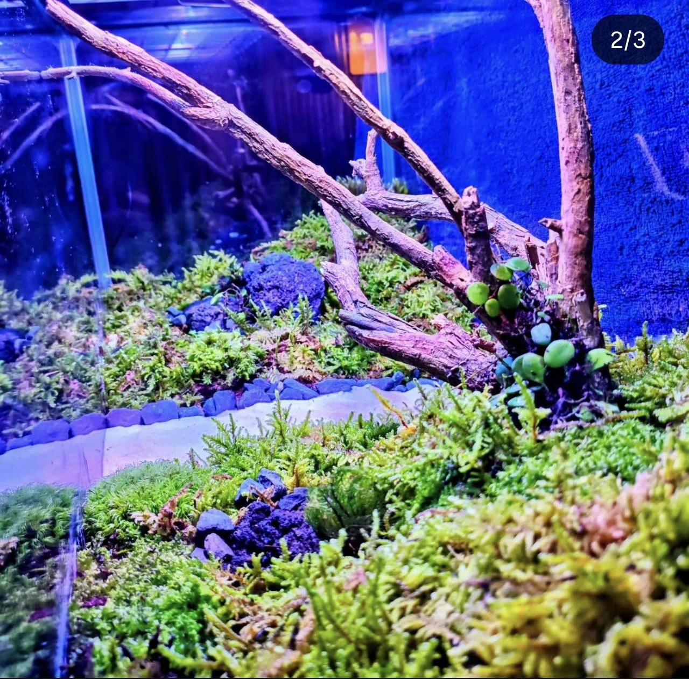
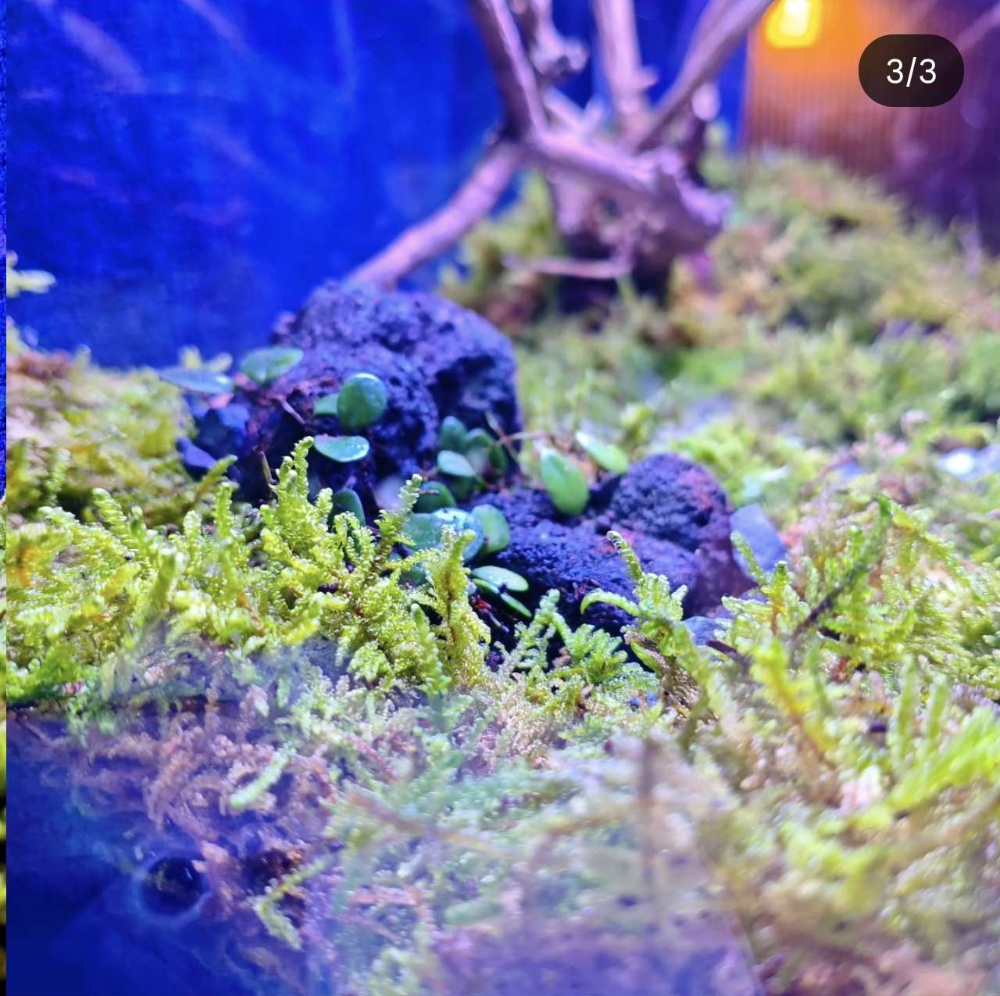

### Portfolio
## **[SITROZYI Official Portfolio](https://sitrozyi.com/)**

### Tech Stack

### Tools

---

📸 Click to see my 65cm Moss Terrarium photo

<table>
  <tr>
    <td width="33%"></td>
    <td width="33%"></td>
    <td width="33%"></td>
  </tr>
</table>

