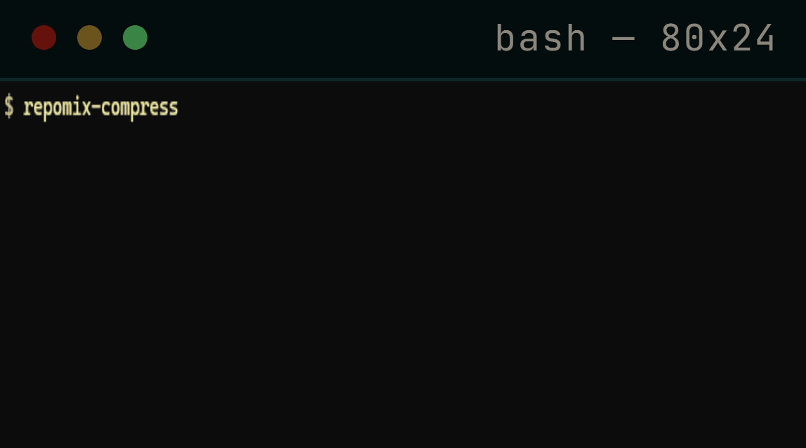

### [Official Portfolio](https://sitrozyi.com/)

### Featured Project (In Active Development)
- **repomix-semantic-compressor** *(Private Beta / npm release coming soon)*
- AST-powered semantic context optimizer & **MCP Server** for Repomix. Reduces LLM prompt tokens by 70%+ via multi-language syntax tree pruning while preserving schema integrity and logic.

  

### Tech Stack & Tooling

### Development Tools

---

📸 Click to see my 65cm Moss Terrarium photo

<table>
  <tr>
    <td width="33%"></td>
    <td width="33%"></td>
    <td width="33%"></td>
  </tr>
</table>

